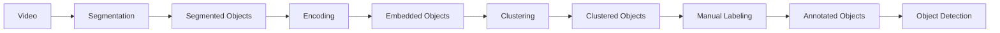
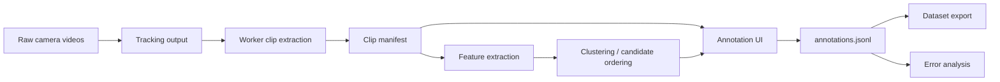

# Semi-automatic Annotation Workflow Spec

Last updated: 2026-05-22

## Purpose

TRUSCO top-view tracking outputから作業者ごとのclip候補を作り、人間が効率よくInspect / Sort / Transportなどの作業ラベルを付けられるannotation workflowを作る。

このworkflowは、認識モデルそのものの前段として、少量ラベル条件で使えるvision datasetを継続的に増やすための研究基盤にする。

## Background

Vision-based warehouse task recognitionでは、最初から高性能な認識モデルを作るより、まず作業ラベル付きclip datasetを増やす仕組みが重要になる。

特にTRUSCOのようなwarehouse-wide top-view tracking基盤では、worker trajectory、zone transition、周辺object、scene state transitionなどを作業認識に使える可能性がある。一方で、それらを評価するには、作業者ごとのclipと作業ラベルが必要になる。

## Prior Work To Reuse

研究室の先行研究として、`vision/Semi-Automated Framework for Digitalizing Multi-Product Warehouses with Large Scale Camera Arrays.pdf` がある。

この研究は、TRUSCO実倉庫に設置された60台超の固定カメラ映像を対象に、物体検出用annotation costを削減する半自動frameworkを提案している。

Pipeline:



Reusable ideas:

- RAFTなどのoptical flowで動物体を切り出す。
- SimSiamやViT Autoencoderでobject cropをembedding化する。
- UMAP / PCAで次元削減し、K-Means / DBSCANで類似objectをcluster化する。
- 人間は個別objectではなくclusterに対してlabelを付ける。
- cluster内の誤混入objectはcheckboxで除外できる。
- annotation timeを明示的な評価指標にする。

Important findings:

- 手動annotationより精度はやや下がるが、annotation timeは大きく削減できる。
- 論文中の比較では、manual annotationが626分だったのに対し、提案手法は最大24分でtraining dataを作成している。
- SimSiamを用いた構成は、精度と作業時間の両面で有望だった。
- DBSCANはcluster数が増え、labeling workloadが増える場合がある。
- optical flow segmentationでは、worker + packet / worker + handpalletのようなmulti-semantic objectが混ざる問題がある。
- SAMなどとの組み合わせは、移動物体以外も扱うための発展候補として議論されている。

Implications for this project:

- 今回の対象はobject class labelingではなくworker activity labelingだが、`segment -> embedding -> clustering -> grouped labeling -> exclusion / correction` という考え方は再利用できる。
- v0/v1では個別clip annotationを作るが、v2では類似clipを束ねて、cluster単位で作業ラベル候補を提示する方向を優先する。
- UIには、cluster内の例外clipを除外・修正する操作を入れる価値がある。
- 評価ではrecognition accuracyだけでなく、annotation time、1時間あたりlabel数、迷ったclip数、修正率を測る。
- 先行研究のBitbucket codeを参照できる場合は、segmentation / embedding / clustering / labeling UIの再利用可能部分を確認する。

## Users / Use Cases

- 研究者が、tracking outputから抽出されたworker clipに作業ラベルを付ける。
- 研究者が、ラベル付けしながらInspect / Sort / Transportの曖昧さや失敗例を観察する。
- 後輩や共同研究者が、同じworkflowで追加データを作る。
- モデル実験用に、annotation結果をdataset formatへexportする。

## Core Workflow



## Terminology

- `clip`: 動画から切り出された、annotation対象の時間範囲。
- `work segment`: `clip` 内の一部または全部に付与される作業ラベル区間。
- `annotation batch`: ユーザーが提供するannotation対象のまとまり。例: 30分程度のJSON。
- `source session`: 元動画やtracking outputのまとまり。annotation batchの由来として保持する場合がある。
- `clip manifest`: annotation UIに渡すclip一覧。

`clip` はOpenAI CLIPなどのfeature extractorと表記が似ているため、特徴量モデルを指す場合は `CLIP feature` のように明記する。

## Design Principles

- Annotation作業を速くする。
- 効率的で楽しいannotation体験にする。低摩擦な操作、進捗の見える化、達成感、迷いにくさをUI設計に入れる。
- 実データ形式が未確定でも進められるよう、まずmanifest駆動にする。
- 実映像処理、tracking、feature extraction、UIを疎結合にする。
- 最初からDBや複数人annotationを入れず、JSON / JSONLで再現しやすくする。
- 人間が迷ったclipや曖昧なラベルを、研究上の観察対象として残せるようにする。
- 1 clip = 1 labelと決め打ちしない。必要に応じて、同じclip内に複数のwork segmentを付けられるようにする。
- 適当に散らばったclipを無限にラベル付けするのではなく、annotation batch単位で「どこまで埋まったか」が見えるようにする。
- cameraや任意時間帯をUI上で選ぶことを主導線にしない。cameraを跨ぐclipがあり、入力も30分程度のJSON batchとして提供される想定にする。
- tracking IDは正しいperson IDとは限らない。必要に応じて、person ID assignment / correctionをactivity annotation前または同一UI内で扱う。

## Data / Interfaces

アノテーションプロトタイプが扱う実データ（トラッキングJSON、歪み補正動画、タイムスタンプキャッシュなど）の共通データ構造や物理配置の詳細については、[TRUSCO Dataset & Tracking Result Specification](../../trusco_dataset_spec.md) を参照してください。

### Clip Manifest

入力はJSON manifestにする。

```json
{
  "version": 1,
  "labels": ["Inspect", "Sort", "Transport", "Other", "Unclear"],
  "clips": [
    {
      "clip_id": "sample-001",
      "batch_id": "2026-05-01_am_batch",
      "source_session_id": "2026-05-01_10h",
      "source_video_id": "cam-02_2026-05-01_10h",
      "person_id": "person-03",
      "original_tracking_id": "track-17",
      "camera_id": "cam-02",
      "start_time": "2026-05-01T10:14:20+09:00",
      "end_time": "2026-05-01T10:14:50+09:00",
      "duration_sec": 30,
      "video_url": "clips/sample-001.mp4",
      "thumbnail_url": "clips/sample-001.jpg",
      "zone_hint": "inspection_table",
      "track_summary": {
        "distance_m": 3.2,
        "dominant_zone": "inspection_table",
        "zone_transitions": ["aisle", "inspection_table"]
      }
    }
  ]
}
```

Required provenance fields:

- `clip_id`
- `batch_id`
- `source_video_id` or equivalent source file reference
- `person_id`
- `original_tracking_id` if available
- `camera_id` or `camera_ids`
- `start_time`
- `end_time`

Optional context fields:

- `duration_sec`
- `video_url`
- `thumbnail_url`
- `zone_hint`
- `track_summary`
- `candidate_reason`
- `source_tracking_file`

### Annotation Output

出力は、単純な場合は1 clipにつき1行のJSONLにする。

```json
{"clip_id":"sample-001","label":"Inspect","confidence":"high","note":"inspection table, little movement","annotated_at":"2026-05-22T12:00:00.000Z"}
```

ただし、1つのclip内で作業が切り替わる場合は、work segmentとして時間範囲付きで出力する。

```json
{"clip_id":"sample-001","work_segments":[{"start_offset_sec":0,"end_offset_sec":18,"label":"Transport"},{"start_offset_sec":18,"end_offset_sec":45,"label":"Sort"}],"confidence":"medium","note":"transport then sorting near shelf","annotated_at":"2026-05-22T12:00:00.000Z"}
```

## High-level Implementation Path

### v0: Manual manifest annotation

manifestを読み込み、clipを見て、作業ラベルとnoteを付け、JSONLでexportする。

### v1: Clip extraction and coverage planning

tracking outputからperson IDごとのclip manifestを生成する。あわせて、annotation batch単位でannotation coverageが見えるようにする。tracking IDが不安定な場合は、person ID assignment / correctionの前処理も検討する。

### v2: Annotation efficiency

先行研究のclustered object labelingの発想をactivity annotationへ拡張する。trajectory feature、CLIP feature、VideoMAEなどで類似clipを並べ、annotation候補提示、cluster-level labeling、例外clipの除外・修正を試す。

### v3: Dataset export

annotation結果をtrain / val / test splitやモデル入力形式へ変換する。

## Research Questions Enabled

- Transportはtrajectory + zone hintだけで判別しやすいか。
- InspectとSortはclipを見ても曖昧か。
- 人間が迷うclipは、どのzone / trajectory / object stateに集中するか。
- annotation UIによって、1時間あたり何clipラベル付けできるか。
- clustering candidate orderingでannotation速度や一貫性が改善するか。
- annotation batch単位で作業ラベルを埋める方が、ランダムclip annotationより有用なdatasetになるか。
- cluster-level labelingは、個別clip labelingに比べてannotation timeをどれだけ削減できるか。

## Non-goals

- 最初から高性能な自動認識モデルを作る。
- 最初から複数人共同annotationや権限管理を入れる。
- 最初から大規模DBを使う。
- 実データの動画やtracking outputをgit管理する。

## Mini Specs

Detailed implementation steps are tracked in [MINI_SPECS.md](MINI_SPECS.md).
